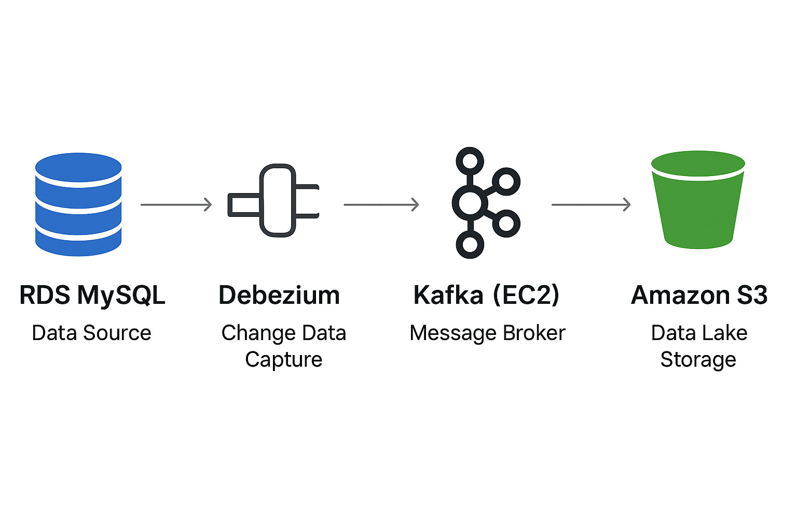

# RDS MySQL to S3 CDC Pipeline with Kafka Connect

This project demonstrates a Change Data Capture (CDC) pipeline using Debezium MySQL Source Connector and Kafka(AWS EC2) S3 Sink Connector.
Data changes in Amazon RDS MySQL are streamed into Kafka topics hosted on AWS EC2 and then persisted into Amazon S3 for storage and analytics.

# Architecture
```
Amazon RDS MySQL
        │
        ▼
Debezium MySQL Source Connector
        │
        ▼
Kafka (hosted on EC2)
        │
        ▼
Kafka S3 Sink Connector
        │
        ▼
   Amazon S3
```

# Workflow

 ### 1.RDS MySQL

* Serves as the primary data source where application data is created and updated.

* Binary Logging (binlog_format = ROW, binlog_row_image = FULL) is enabled through a custom DB parameter group, allowing Debezium to capture all row-level changes.

* Any INSERT, UPDATE, or DELETE operation in MySQL is recorded in the binary logs.

### Kafka

* Acts as the event streaming backbone of the pipeline.

* Ensures that captured changes are durably stored and replayable.

* Provides scalability by decoupling the source (MySQL) from the sinks (S3, Snowflake, etc.).

*Maintains separate topics for each table, making downstream processing and schema evolution easier to handle.

### Debezium MySQL Source Connector

* Runs inside Kafka Connect on the EC2-hosted Kafka cluster.

* Continuously streams changes from the MySQL binary logs.

* Transforms database changes into structured CDC events (JSON format by default).

* Publishes each event to the corresponding Kafka topic (one topic per table).

**Configuration file:** [mysqlsourse-connector.json](mysqlsource-connector.json)

**Register Debezium MySQL connector:** 

    curl -X POST -H "Content-Type: application/json" \
      --data @mysql_connector.json \
      http://<KAFKA_CONNECT_HOST>:8083/connectors


### Kafka S3 Sink Connector

* A sink connector running inside Kafka Connect.

* Subscribes to the topics created by Debezium.

* Streams events to Amazon S3 in the chosen serialization format (JSON, Avro, or Parquet).

* Provides options like partitioning by topic, timestamp, or key, enabling efficient querying later.

**Configuration file:** [s3-sink-connector-cdc.json](s3-sink-connector-cdc.json)

**Register S3 Sink connector**:

    curl -X POST -H "Content-Type: application/json" \
      --data @sink_connector_cdc.json \
      http://<KAFKA_CONNECT_HOST>:8083/connectors


### Amazon S3

* Acts as the data lake storage for CDC events.

* Stores immutable, time-stamped event data for future analysis.


# Diagram



## Conclusion  

This project demonstrates a complete **Change Data Capture (CDC) pipeline** using Amazon RDS MySQL, Debezium, Apache Kafka, and Amazon S3.  
It ensures that every change in the database is **captured in real-time**, transported through Kafka, and stored durably in S3.  
The data stored in S3 can later be used for **analytics, reporting, or downstream processing** with tools like Athena, Redshift, or Snowflake.  

